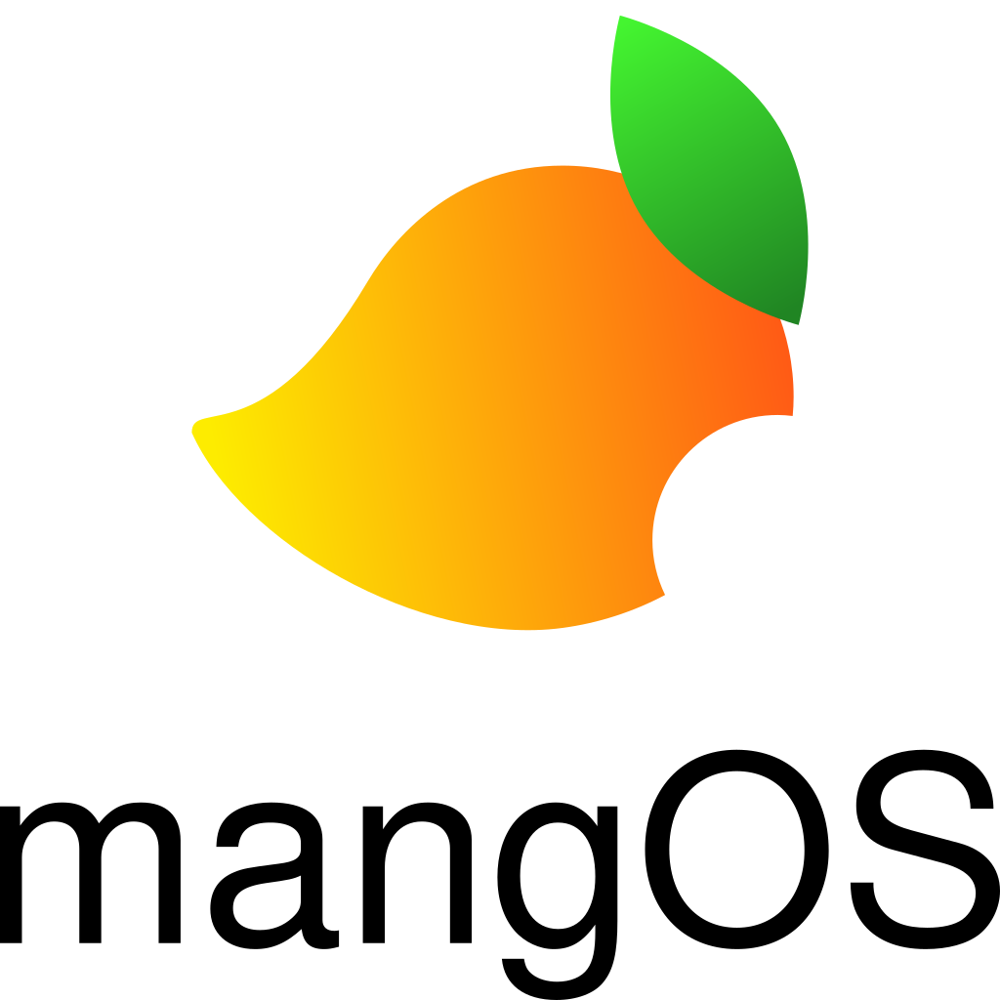

mangOS is a Linux-based operating system designed for aesthetic beauty, a pleasant user experience, and high flexibility while preserving sensible defaults.

Two editions are available, libre and non-libre, to better suit the user. If you're new to Linux, we recommend the non-libre edition to get more comfortable. For more seasoned users, the libre edition may be preferred. The difference between the two is marginal, although the non-libre edition includes components such as Nvidia drivers or Google Chrome installed out of the box.
